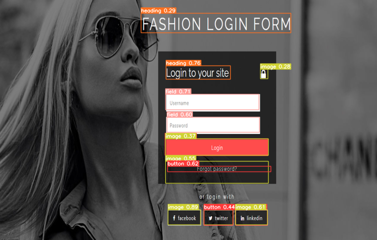

# Web Element Detection using YOLOv8

## Overview

This project implements a computer vision model using YOLOv8 for detecting and identifying various web elements in Figma webpages. The model can identify elements such as 'button', 'field', 'heading', 'iframe', 'image', 'label', 'link', 'text'. It creates bounding boxes around each identified element and tags them with the corresponding element name.

## Sample Reference Images

Sample reference images for evaluation can be found [here](https://www.figma.com/community/file/1132396044075007632/tortilicious-a-fast-food-app).

## Sample Results

Sample results generated by the model can be viewed [here](https://drive.google.com/drive/folders/16jbyjKMfgdv6l5QHLaDRH44kv4iAwCgZ?usp=sharing).

### Prerequisites

- Python 3.x
- YOLOv8 (ultralytics 8.0.54)

